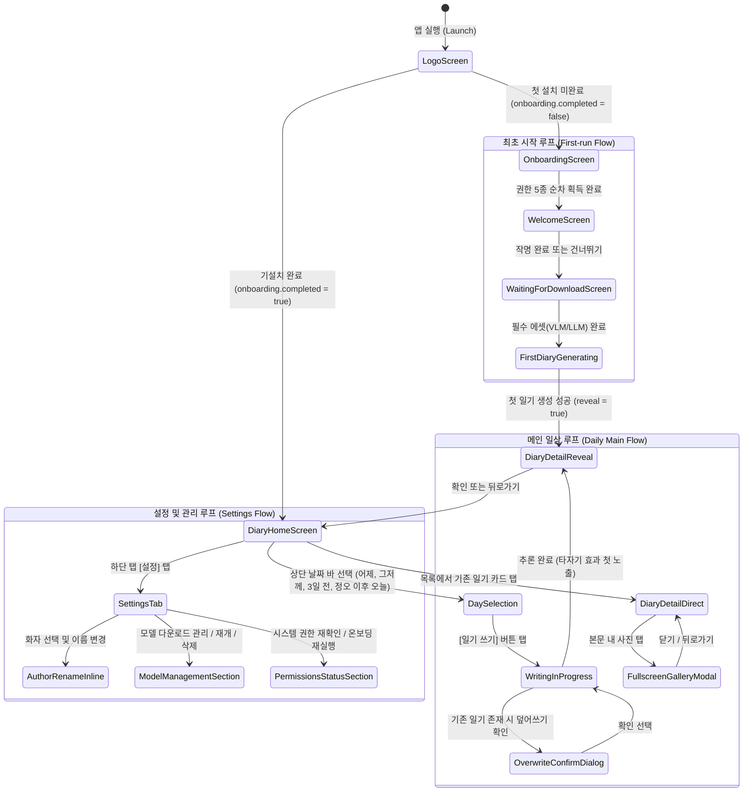

# Alpharium Modernist UI/UX 마스터 기획서 (Integrated Master Specification)

> **문서 상태**: 확정 (Active Specification)  
> **최초 작성일**: 2026-09-19  
> **기준 디자인 보드**: `Alpharium Mobile Screens (standalone).html` (화면 ID: `1a`, `1d`~`1e`, `1i`~`1j`, `1k`~`1n`, `1o`~`1s`, `1y`)  
> **관련 로드맵**: `docs/roadmap/README.md` (과제 27번~35번)

---

## 1. 개요 및 로드맵 인덱싱 맵 (Roadmap Cross-Reference)

본 문서는 알파리움의 새로운 디자인 시스템인 **Modernist(모더니스트)**를 앱 전체에 일관되게 적용하기 위한 **단일 통합 UI/UX 마스터 기획서**입니다.  
스플래시 및 온보딩부터 일기 목록, 작성 진행 연출, 상세 본문, 갤러리, 설정 탭에 이르는 전체 사용자 여정을 다루며, `docs/roadmap/README.md`의 세부 로드맵 과제(27번~35번 / 스펙 043~051)와 1:1로 직결되도록 구성되었습니다.

### 1.1 로드맵 연계 인덱싱 매핑 테이블

| 로드맵 # | 스펙 ID | 본 기획서 섹션 | 대상 화면 / 컴포넌트 | 디자인 보드 ID | 진행 상태 |
| :---: | :---: | :--- | :--- | :---: | :---: |
| **27** | `043` | [§4.1 스플래시 및 자동 순차 권한 흐름](#41-스플래시-및-자동-순차-권한-요청-흐름-로드맵-27번--043) | `LogoScreen`, `OnboardingScreen` | `1k`~`1n` | 완료 (PR #72) |
| **28** | `044` | [§4.2 첫 만남 및 캐릭터 작명](#42-첫-만남-및-캐릭터-작명-로드맵-28번--044) | `WelcomeScreen` (3가지 상태: `checking`, `welcome`, `failed`) | `1a` | 완료 (PR #73) |
| **29** | `045` | [§4.3 필수 에셋 다운로드 전용 화면](#43-필수-자산-다운로드-동의-및-진행-화면-로드맵-29번--045) | `WaitingForDownloadScreen` (슬라이드 4종 + 진행률 바) | `1o`~`1s`, `1q` | 진행 중 (PR #74) |
| **30** | `046` | [§4.4 일기 목록 및 쓰기 진입](#44-일기-목록-및-쓰기-진입-로드맵-30번--046) | `DiaryListScreen`, `DayPicker`, 일기 카드, 빈 상태 뷰 | `1d`, `1e` | **예정 (차기 과제)** |
| **31** | `047` | [§4.5 일기 작성 연출 및 보조 화면](#45-일기-작성-진행-독백-연출-및-보조-화면-로드맵-31번--047) | `DiaryHomeScreen`(writing 독백), `OverwriteConfirm`, `BuildError` | `1y` | 예정 |
| **32** | `048` | [§4.6 일기 상세 본문 및 관측 신호](#46-일기-상세-본문-및-관측-신호-로드맵-32번--048) | `DiaryDetailScreen` (타이포그래피, 타자기 reveal, "본 것" 메타) | `1i`, `1j` | 예정 |
| **33** | `049` | [§4.7 사진 슬라이더 및 풀스크린 갤러리](#47-사진-슬라이더-및-풀스크린-갤러리-모달-로드맵-33번--049) | `DiaryDetailScreen` 내 가로 페이징 슬라이더, 코어 RN 모달 갤러리 | `1i`, `1j` 발췌 | 예정 |
| **34** | `050` | [§4.8 전역 하단 탭 바 & 설정 기본 섹션](#48-전역-하단-탭-바--설정-기본-섹션-로드맵-34번--050) | 전역 탭 바, `AuthorPicker`(인라인 작명), `Geocoding`, `AutoDiary` | 홈/상세 프레임 공통 | 예정 |
| **35** | `051` | [§4.9 설정 탭 모델 관리 및 권한 관리](#49-설정-탭-모델-관리-및-권한-관리-로드맵-35번--051) | `CharacterListScreen`, `ModelSection`, `PermissionsSection` | 043 팔레트 상속 | 예정 |

### 1.2 구현 원칙: 화면별 착수 전 `/using-superpowers` 기반 정밀 구체화 의무

본 마스터 기획서는 전체 디자인 시스템의 방향성, 상태 전이, 공통 규격 및 헌법 제약을 정의하는 **상위 청사진(High-level Blueprint)**입니다.  
실제 화면 단위의 UI/UX 세부 디테일(컴포넌트 분할, 미세 패딩·간격, 애니메이션 타이밍, 특수 예외 상태 등)은 개발 착수 시점에 다음 원칙에 따라 정밀하게 구체화합니다:

1. **착수 전 `/using-superpowers` 브레인스토밍 필수 (MUST)**:
   - 각 로드맵 과제(046~051) 착수 시, 코드를 작성하기 전에 반드시 `/using-superpowers` (`brainstorming` 스킬)을 실행합니다.
   - 본 마스터 기획서의 해당 화면 명세(§4.x)를 출발점으로 삼아, 사용자 질의응답 및 리뷰를 통해 화면별 세부 UI/UX 인터랙션을 완전히 합의합니다.
2. **화면별 스펙 문서 동기화 (Sync with `specs/0xx-*/spec.md`)**:
   - 구체화된 내용은 해당 스펙 디렉토리의 `spec.md` 및 `tasks.md`에 구체적 요구사항(FR, SC)으로 명문화하고, 본 마스터 기획서의 해당 절에도 변경 사항을 반영합니다.
3. **계약 보호 검증 선행 (TDD)**:
   - 브레인스토밍과 플랜 수립 후 `test-driven-development`를 통해 기존 헌법 규칙 및 화면별 계약(타자기, 갤러리, 1회성 소요 시간 등)의 계약 테스트를 먼저 세운 뒤 안전하게 구현합니다.

---

## 2. Modernist 디자인 철학 및 시스템 토큰 규격

### 2.1 디자인 철학 (Design Philosophy)
- **신문과 활판 인쇄 지면(Print-page)의 메타포**: 화면은 차가운 디지털 인터페이스가 아니라, 종이 지면에 정갈하게 활자를 조판한 듯한 문학적·출판적 온도를 갖습니다.
- **최소한의 강렬함(Minimal & Bold)**: 과도한 그라데이션, 화려한 그림자, 입체 효과를 배제하고, 순수한 오프화이트 바탕 위에 정교한 선(Rules), 여백(Whitespace), 그리고 레드 스퀘어/액센트를 통해 시선과 맥락을 이끕니다.
- **사람의 언어로 말하는 인터페이스**: 기계적인 시스템 상태 대신, "휴대폰이 화자가 되어 주인의 하루를 묵묵히 관찰하고 기록한다"는 앱의 정체성을 담은 정직하고 따뜻한 문장을 사용합니다.

### 2.2 헌법 준수 UI 원칙 (Constitutional UI Principles)
- **원칙 IV 절대 준수 (바이트·성능 수치 노출 금지)**:
  - 모델 다운로드 및 일기 생성 중에는 **바이트 수(MB/GB), 다운로드 속도(MB/s), 토큰 수(tokens/s), 경과 시간 카운터(초 단위 실시간 시계)를 사용자 화면에 절대 노출하지 않습니다 (MUST NOT).**
  - 진행률은 비율(0~100%) 또는 단계 슬라이드와 "받는 중", "다 받았어요" 같은 사람의 말로 표현합니다.
- **원칙 I & II 준수 (정직한 상태 표현)**:
  - 사진이 0장인 날(`none`)과 권한이 없어 못 읽은 날(`unknown`)을 분리하여 정직하게 표시합니다.
  - 생성된 일기는 사후 보정이나 임의 편집 없이 온디바이스 엔진이 완성한 그대로 사용자에게 노출합니다.
- **사후 1회성 소요 시간 노출 (헌법 v1.2.0)**:
  - 생성 중에는 시계를 돌리지 않지만, 일기 작성이 완료된 상세 화면 하단 메타데이터 영역에는 "사진 3장을 보는 데 41초가 걸렸어요", "일기를 쓰는 데 1분 12초가 걸렸어요"와 같이 **완료 후 1회에 한해 소요 시간을 정직하게 안내**합니다.

### 2.3 시스템 디자인 토큰 (`src/ui/theme/tokens.ts`)
043에서 확립된 팔레트를 앱 전체 화면에서 단일 토큰으로 소비합니다:

```typescript
export const MODERNIST_COLORS = {
  background: '#f3f2f2',        // 메인 지면 (오프화이트)
  surface: '#eae9e9',           // 카드, 모달, 서브 영역 바탕
  text: '#201e1d',              // 메인 활자 (먹색에 가까운 차콜 다크)
  mutedText: '#6f6c6a',         // 보조 캡션, 힌트, 레이블
  accent: '#ec3013',            // 브랜드 시그니처 레드 (포인트, 액션)
  accentForeground: '#000000',  // 악센트 위 텍스트/아이콘
  border: 'rgba(32, 30, 29, 0.15)', // 지면 분할 실선
  divider: 'rgba(32, 30, 29, 0.35)',// 두꺼운 섹션 구분선
  danger: '#c22b12',            // 삭제/경고/중단
};
```

- **타이포그래피 계층**:
  - `Hero Title`: 32~38px, Bold/ExtraBold, Letter-spacing -0.025em (첫 만남, 브랜드 로고)
  - `Section / Folio Title`: 20~24px, Bold, 신문 헤드라인 성격
  - `Body Text`: 16~17px, Line-height 1.6, Regular/Medium, `word-break: keep-all`
  - `Kicker / Meta / Caption`: 11~13px, Medium/SemiBold, 대문자 또는 카테고리 태그
- **인터랙션 및 피드백 규격**:
  - 터치 피드백: 모든 클릭 가능한 버튼 및 행(Row)은 033 계약에 따라 터치 시 `scale 0.97`의 즉각적 물리 반응을 제공합니다.
  - 라이트 모드 고정: One UI 8.5+ 시스템 다크 모드 환경에서도 배경이 어두워지거나 색조가 깨지지 않도록 순수 라이트 지면을 엄격히 유지합니다 (031 계약).

---

## 3. 전역 사용자 여정 및 상태 머신 (User Journey & State Machine)



---

## 4. 로드맵 단계별 상세 UI/UX 명세 (043 ~ 051)

### 4.1 스플래시 및 자동 순차 권한 요청 흐름 (로드맵 27번 / 043)
- **상태**: 구현 및 실기기 검증 완료 (PR #72)
- **참조 디자인 보드**: 화면 ID `1k` (Splash), `1l`~`1n` (Permission Dialogs)
- **구성 요소**:
  - `LogoScreen`: 화면 정중앙의 정방형 레드 스퀘어(16×16) + 'Alpharium' 볼드 로고 + 하단 미니멀 로딩 인디케이터.
  - `OnboardingScreen`: 불필요한 사전 안내 카드나 설명 단계를 걷어내고, 사진 보관함 → 사진 위치 → 기기 위치 → 알림 순으로 시스템 권한 다이얼로그를 자동 순차 팝업.
  - 배터리 최적화 예외 안내: 시스템 다이얼로그가 없는 Android 특성에 맞춰 모더니스트 스타일의 단일 카드 형태로 유지.

---

### 4.2 첫 만남 및 캐릭터 작명 (로드맵 28번 / 044)
- **상태**: 구현 및 실기기 검증 완료 (PR #73)
- **참조 디자인 보드**: 화면 ID `1a` (First Encounter / Naming)
- **구성 요소 및 UI 레이아웃**:
  - **헤더**: 대형 헤드라인 `welcomeTitle` ("깨어났어요. 처음 뵙겠습니다.")
  - **안내문**: `welcomeBody` ("이제부터 제가 주인님의 하루를 사진과 다닌 자리로 읽고, 일기로 적을게요. 모든 일은 이 휴대폰 안에서만 일어나요.")
  - **구분선**: 2px 하단 보더 Divider
  - **작명 입력 영역**:
    - 라벨: `namePrompt` ("제 이름을 지어주세요.")
    - 인풋 필드: 밑줄(Border-bottom 2px) 스타일, 28px 볼드 타이포, 커서 깜빡임 효과, 우측 글자 수 카운터 (`N / 10`, 035 계약에 따라 최대 10자).
    - 힌트: `nameHint` ("10자까지. 나중에 설정에서 바꿀 수 있어요.")
  - **하단 액션 바**:
    - [이 이름으로 할래요] (Primary 레드 버튼) / [나중에 할래요] (Secondary 고스트 버튼)
- **백그라운드 병렬 다운로드 연계**:
  - 040 계약에 따라 본 화면 진입 즉시 백그라운드에서 필수 모델(VLM & LLM) 다운로드가 병렬로 트리거됩니다.

---

### 4.3 필수 자산 다운로드 동의 및 진행 화면 (로드맵 29번 / 045)
- **상태**: 구현 진행 중 (PR #74)
- **참조 디자인 보드**: 화면 ID `1o`, `1p`, `1r`, `1s` (슬라이드 1~4), `1q` (완료)
- **화면 목적**:
  - 백그라운드에서 모델을 받는 동안 사용자가 지루함을 느끼지 않고 앱의 가치를 신뢰할 수 있도록 4개의 철학 안내 슬라이드를 스와이프 가능한 형태로 제공합니다.
- **슬라이드 카피라이팅 규격 (KO Dictionary)**:
  1. 슬라이드 1: **"쓰지 않아도 남는 하루"** / "따로 적을 일이 없어요. 그날의 사진과 다닌 자리만으로 하루가 한 편 남습니다."
  2. 슬라이드 2: **"나중에 다시 읽고 싶은 기록"** / "목록도 통계도 아닙니다. 그날을 아는 사람이 쓴 문장이라, 몇 달 뒤에 읽어도 그 하루가 떠올라요."
  3. 슬라이드 3: **"잠들기 전에 도착해요"** / "하루가 끝나면 알아서 씁니다. 다 되면 한 번만 알리고, 그 뒤로는 조용해요."
  4. 슬라이드 4: **"휴대폰 안에서만 남아요"** / "사진도 문장도 기기 안에만 남습니다. 계정도 서버도 필요 없어요."
- **진행률 표현 (헌법 원칙 IV 엄격 적용)**:
  - 원본 HTML의 `310MB / 1.2GB`와 같은 바이트 크기 노출은 **절대 금지**.
  - **정직한 표현**: "준비하는 중", "필수 모듈을 받는 중입니다", "다 받았어요" 텍스트와 얇은 레드 프로그레스 바로만 시각화.
  - 다운로드 실패 시 [다시 시도하기] 버튼을 명확히 제공.

---

### 4.4 일기 목록 및 쓰기 진입 (로드맵 30번 / 046)
- **상태**: **차기 구현 대상 (Next Spec)**
- **참조 디자인 보드**: 화면 ID `1d` (Poster Layout), `1e` (Journal Archive Layout)
- **화면 구조 및 레이아웃**:
  - **상단 날짜 선택 바 (`DayPicker`)**:
    - 가로 롤링 또는 탭 방식: 어제, 그저께, 3일 전 및 (정오 이후인 경우) 오늘을 선택 가능.
    - 선택된 날짜는 볼드 강조와 하단 레드 인디케이터로 포커스.
    - 해당 날짜의 신호 수집 요약 힌트 표기: 예) "사진 3장 · 다닌 자리 2곳".
  - **주요 쓰기 진입 배너 (`Write Banner`)**:
    - 아직 일기를 쓰지 않은 날: "오늘은 아직 쓰지 않았어요", "이 날을 쓰기" 액션 버튼 제공.
    - 정오 이전 오늘인 경우: "오늘 일기는 정오(12:00) 이후에 쓸 수 있어요" 정직한 게이트 안내 (012 계약).
  - **일기 아카이브 카드 목록 (`Diary Cards`)**:
    - 작성된 일기가 있는 경우 카드 형태로 정렬 (날짜, 작성 당시 지정된 화자 이름, 본문 앞 2~3줄 미리보기, 사진 썸네일 힌트).
    - 일기가 하나도 없을 때의 빈 상태(Empty State): 정갈한 활판 인쇄 스타일의 "아직 남겨진 일기가 없습니다" 안내문.
- **계약 보호**:
  - 006 S1 계약: 읽기와 쓰기는 명확히 분리되며, 목록 화면은 쓰기 진행 상태와 독립적으로 렌더링됩니다.

---

### 4.5 일기 작성 진행 독백 연출 및 보조 화면 (로드맵 31번 / 047)
- **상태**: 예정
- **참조 디자인 보드**: 화면 ID `1y` (Writing - Red Statement)
- **UI 레이아웃 및 독백 연출 (`DiaryHomeScreen` writing 상태)**:
  - **배경**: 지면 전체를 차분하고 압도적인 Modernist Red(#ec3013) 필드로 채우거나 강렬한 레드 프레임 적용.
  - **중앙 메시지**:
    - 상단 키커: `writingKicker` ("쓰는 중")
    - 화자 상태 알림: `writingBy` ("OO이 쓰고 있어요. 진행률은 세지 않아요.")
    - 감성 독백 텍스트: 039 계약의 `monologue1`, `monologue2` 등이 타자기 애니메이션(`TypewriterText`)으로 순차 재생.
      - "사진 속에 뭐가 담겼는지 찬찬히 보는 중…"
      - "연필과 지우개를 준비하는 중…"
    - 안내 주석: `writingNote` ("얼마나 걸릴지는 말하지 않아요. 끝나면 첫 글자부터 보여드릴게요.")
  - **하단 액션**: [그만두기] (007 계약에 따른 사용자 통제 버튼, 터치 시 즉시 추론 인터럽트).
- **보조 다이얼로그**:
  - `OverwriteConfirmScreen`: 이미 일기가 존재하는 날 다시 작성을 누른 경우, 덮어쓰기 경고 및 확인/취소 팝업.
  - `BuildErrorScreen`: 추론 중 에러 발생 시(메모리 부족, 모델 미응답 등) 사용자에게 정직하게 안내하고 복구 경로 제공.
- **헌법 원칙 IV 절대 방어**:
  - 퍼센트(%), 프로그레스 바, 경과 초(seconds)를 일체 표시하지 않습니다.

---

### 4.6 일기 상세 본문 및 관측 신호 (로드맵 32번 / 048)
- **상태**: 예정
- **참조 디자인 보드**: 화면 ID `1i` (Journal Page - Folio/Footnotes), `1j` (Photo Plate Layout)
- **UI 레이아웃 및 타이포그래피**:
  - **상단 헤더(Folio)**: 날짜(예: "2026.09.13 토요일"), 볼드 일기 제목, 작성자 서명.
  - **일기 본문 지면**:
    - 신문/소설책 단행본 수준의 고급 타이포그래피 조판.
    - 038 타자기 연출(`reveal` 플래그 계약):
      - 일기 **작성 완료 직후 첫 진입 시(`reveal === true`)**: 본문 첫 글자부터 한 글자씩 타자기로 찍혀 나오는 연출을 실행.
      - 일기 **목록에서 다시 열람할 때(`reveal === false`)**: 지연 없이 전체 텍스트가 즉시 렌더링.
  - **하단 각주 관측 신호 영역 ("이 일기가 본 것" - 017 계약)**:
    - 타이틀: `sawTitle` ("OO은 이렇게 일기를 작성했어요.")
    - 관측 사실 요약:
      - `saw1`: "사진 N장을 보는 데 41초가 걸렸어요." (사후 1회성 소요 시간)
      - `saw2`: "다닌 자리 · 대표 장소 반포한강공원 · 2곳"
      - `saw3`: "일기를 쓰는 데 1분 12초가 걸렸어요." (사후 1회성 생성 시간)

---

### 4.7 사진 슬라이더 및 풀스크린 갤러리 모달 (로드맵 33번 / 049)
- **상태**: 예정
- **참조 디자인 보드**: 화면 ID `1i`, `1j` 내 사진 플레이트 요소
- **컴포넌트 규격 (025 계약 단독 격리 및 계승)**:
  - **인라인 가로 슬라이더**:
    - 본문 상단 또는 하단에 배치되는 가로 페이징 슬라이더.
    - RN 코어 `ScrollView` 기반 (`horizontal`, `pagingEnabled`). 외부 무거운 제스처 패키지 배제.
    - 슬라이더 하단 위치 표시: `1 / 8` 형태의 순번 텍스트 (`accessibilityLabel` 필수 적용).
    - VLM이 실제로 살펴본 최대 8장의 리사이즈 사본 이미지 표기.
  - **풀스크린 갤러리 뷰어 (`Modal`)**:
    - 슬라이더 썸네일 탭 시 즉시 풀스크린 모달 진입.
    - 배경: 순수 딥 블랙(#000000).
    - 좌우 스와이프로 1~8장 사진 탐색, 끝에서 튕김(순환 없음).
    - 안드로이드 물리 뒤로가기 버튼(`onRequestClose`) 및 상단 닫기 [✕] 버튼 지원.
    - 확대/축소(Pinch zoom)는 025 범위 밖 결정을 유지하여 가볍고 안정적인 코어 RN 컴포넌트로 완결.

---

### 4.8 전역 하단 탭 바 & 설정 기본 섹션 (로드맵 34번 / 050)
- **상태**: 예정
- **참조 디자인 보드**: 홈 및 상세 프레임 하단 공통 탭 바 영역
- **하단 탭 바 구성**:
  - `[ 일기 ]` / `[ 설정 ]` / `( 개발자 )`
  - 액티브 탭: 볼드 텍스트 + 상단 레드 액센트 인디케이터 라인.
  - 비활성 탭: 차콜 뮤트(#6f6c6a) 텍스트.
- **설정 탭 기본 섹션 (`SettingsScreen`)**:
  - **작성자 페르소나 선택기 (`AuthorPicker`)**:
    - 등록된 캐릭터(금동이 등) 목록 노출.
    - 인라인 이름 변경(Rename) 기능: 035 실측에 따라 `<View key={index}>` 위치 기반 키를 사용하여 편집 중 언마운트 버그를 완벽히 방지.
  - **일반 설정 토글**:
    - 장소명 변환 설정 (`GeocodingSettingToggle`): 온디바이스 역지오코딩 활성화 여부.
    - 자동 일기 쓰기 (`AutoDiarySettingsScreen`): 밤 시간대 백그라운드 자동 일기 예약 토글.

---

### 4.9 설정 탭 모델 관리 및 권한 관리 (로드맵 35번 / 051)
- **상태**: 예정
- **참조 디자인 보드**: 043 팔레트를 상속하는 설정 서브 뷰
- **모델 관리 섹션 (`CharacterListScreen`, `ModelSection`)**:
  - 로스터 모델(LLM) 및 비전 모델(VLM)의 디스크 설치 상태 목록.
  - 다운로드 버튼 / 이어받기 / 모델 삭제 액션.
  - 008 다운로드 충돌 방지 및 026 세그먼트 병렬 이어받기 상태 머신 계승.
- **권한 관리 섹션 (`PermissionsSection`)**:
  - 사진, 위치, 알림, 배터리 예외의 현재 시스템 권한 상태를 한눈에 볼 수 있는 카드.
  - 권한이 거부된 항목이 있는 경우 [온보딩 절차 다시 실행] 버튼을 제공하여 재획득 유도.

---

## 5. 핵심 인터랙션 및 기존 비즈니스 계약 보호 규정

| 계약 항목 | 기준 스펙 | 핵심 준수 사항 | 위반 시 발생하는 위험 |
| :--- | :---: | :--- | :--- |
| **타자기 첫 노출 (`reveal`)** | `038` | 신규 생성 직후 첫 진입 시에만 타자기 연출을 켜고, 목록에서 다시 열람할 때는 즉시 렌더링 | 사용자가 과거 일기를 볼 때마다 매번 타자기를 기다려야 하는 치명적 UX 결함 발생 |
| **소요 시간 사후 노출** | `017` / 헌법 v1.2.0 | 생성 중에는 시간을 세지 않고, 완료된 상세 화면에만 1회성으로 N초 소요를 정직하게 기록 | 헌법 원칙 IV 위반 (실시간 성능 지표 노출) |
| **코어 RN 갤러리 격리** | `025` | `react-native-pager-view` 등의 추가 네이티브 패키지 없이 순수 RN `ScrollView` + `Modal`로 구현 | 네이티브 링킹 실패, 안드로이드 빌드 오류 및 릴리스 배포 위험 |
| **사진 캡션 상한 8장** | `023` | 시간 분포 알고리즘을 거친 최대 8장의 사진만 VLM 캡션 및 상세 슬라이더에 공급 | LLM 컨텍스트(`n_ctx`) 초과 및 생성 타임아웃(180초) 초과 위험 |
| **작명 인라인 에디터 키** | `035` | `AuthorPicker` 렌더링 시 표시 이름을 키로 쓰지 않고 고정 인덱스(`key={index}`)를 사용 | 이름 수정 타이핑 시 컴포넌트가 리마운트되어 포커스와 상태가 유실됨 |
| **세그먼트 다운로드** | `026` / `041` | `Range` 헤더 기반 네이티브 `DownloadTask`로 다운로드하여 힙 메모리 OOM을 차단 | 대용량 모델 수신 중 OutOfMemoryError 크래시 재발 |
