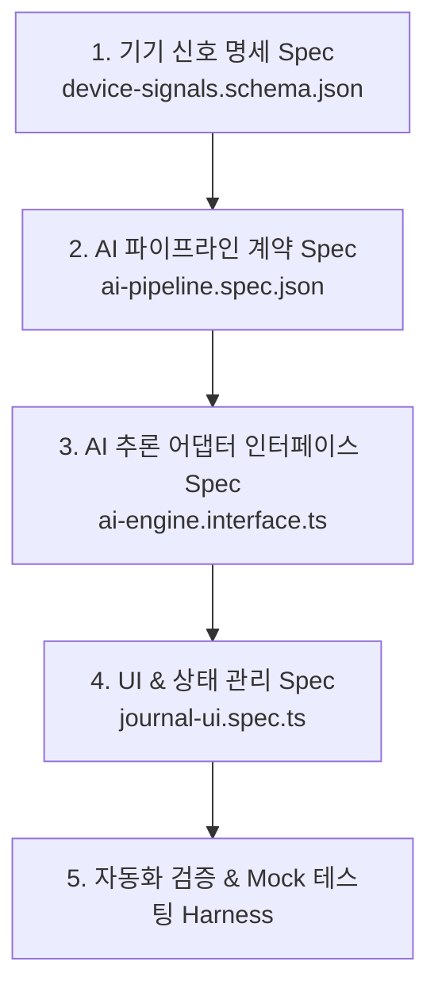

# 📐 Spec-Kit (Spec-First) 개발 방법론 가이드
## : 온디바이스 AI 일기 작성 앱 (Expo + EXAONE 1.2B)

> **Spec-First 개발이란?**  
> 코드 작성 이전에 **데이터 규격(Schema), API 계약(Contract), AI 입력/출력 명세(AI Prompt Spec), UI 사양(Component Spec)**을 완벽히 정의하고, 이 스펙(Spec)을 기준으로 모바일 프론트엔드와 AI 파이프라인을 병렬로 개발하는 방식입니다.

---

## 🏗️ Spec-Kit 5단계 개발 로드맵



---

## 📄 1단계: 기기 신호 명세 스펙 (`device-signals.schema.json`)

Expo에서 수집할 6가지 개인 로그의 통합 데이터 규격을 JSON Schema로 명확히 정의합니다.

```json
{
  "$schema": "http://json-schema.org/draft-07/schema#",
  "title": "DailyDeviceSignalPackage",
  "type": "object",
  "properties": {
    "date": { "type": "string", "format": "date" },
    "daily_stats": {
      "type": "object",
      "properties": {
        "total_steps": { "type": "integer" },
        "sleep_hours": { "type": "number" },
        "wifi_locations": { "type": "array", "items": { "type": "string" } }
      },
      "required": ["total_steps"]
    },
    "timeline_logs": {
      "type": "array",
      "items": {
        "type": "object",
        "properties": {
          "timestamp": { "type": "string", "format": "date-time" },
          "location_name": { "type": "string" },
          "photo_uri": { "type": "string" },
          "photo_vision_caption": { "type": "string" },
          "calendar_event": { "type": "string" }
        },
        "required": ["timestamp", "location_name"]
      }
    }
  },
  "required": ["date", "daily_stats", "timeline_logs"]
}
```

---

## 🤖 2단계: AI 프롬프트 & 입출력 계약 명세 (`ai-pipeline.spec.json`)

Stage 1(비전 분석)과 Stage 2(EXAONE 일기 합성)의 입력/출력 포맷 계약을 규정합니다.

### 📥 AI 입력 계약 (Input Contract)
* `DailyDeviceSignalPackage` ➔ Prompt Formatter를 거쳐 텍스트로 정제

### 📤 AI 출력 계약 (Output Contract - Structured JSON)
LLM이 마크다운 대신 파싱 가능한 구조화된 JSON 객체를 리턴하도록 스펙을 강제합니다:

```json
{
  "title": "성수동의 아침과 기분 좋은 산책으로 마무리한 하루",
  "content": "오늘 아침엔 성수동 카페에서 시원한 아메리카노 한 잔으로...",
  "mood_tag": "평온함",
  "key_locations": ["성수동 카페거리", "강남역", "한강공원"],
  "highlight_activity": "한강 런닝 5km"
}
```

---

## 🔌 3단계: AI 추론 엔진 인터페이스 명세 (`ai-engine.interface.ts`)

개발 단계와 운영 단계에서 **엔진을 언제든 바꿀 수 있도록 추상화 인터페이스(Adapter Pattern)**를 설계합니다.

```typescript
export interface AIInferenceEngine {
  // Stage 1: 이미지 시각 분석
  analyzeImage(imageUri: string): Promise<string>;
  
  // Stage 2: 일기 작성 (JSON Schema 출력 강제)
  generateDiary(signals: DailyDeviceSignalPackage): Promise<DiaryOutput>;
}

// 1) 단위 테스트용 Mock 어댑터
export class MockAIEngine implements AIInferenceEngine { ... }

// 2) 개발 단계용 (맥북 호스트 API 연동: https://macbook.yattle-mora.ts.net/v1)
export class DevMacbookAIEngine implements AIInferenceEngine { ... }

// 3) 상용 배포용 (스마트폰 pure 온디바이스: CoreML / ExecuTorch EXAONE 1.2B)
export class MobileOnDeviceAIEngine implements AIInferenceEngine { ... }
```

---

## 📱 4단계: 프론트엔드 UI & 상태 명세 (`journal-ui.spec.ts`)

Expo 모바일 앱의 화면 구조와 Zustand/Redux 상태 스펙을 정의합니다.

1. **`TimelineScreen Spec`**: 오늘 수집된 신호(지도, 걸음수, 사진) 리스트 노출
2. **`DiaryGenerationScreen Spec`**: 온디바이스 AI 추론 진행률(Progress Bar) 표시 및 결과 확인
3. **`DiaryArchiveScreen Spec`**: 생성된 일기 로컬 데이터베이스(SQLite/MMKV) 저장 및 조회

---

## 🧪 5단계: Spec 기반 테스트 & 개발 이점

1. **프론트엔드 - AI 백엔드 완전 병렬 개발 가능:**  
   AI 모델이 완성되기 전이라도 `MockAIEngine`을 통해 UI 개발자가 앱 화면 전체를 완성할 수 있습니다.
2. **엔진 교체 용이성:**  
   테스트 환경(맥북 API 서버) ➔ 운영 환경(스마트폰 온디바이스)으로 넘어갈 때 `ai-engine.interface.ts` 어댑터 클래스 1개만 바꿔 끼우면 앱 전체가 변경 없이 동작합니다.
