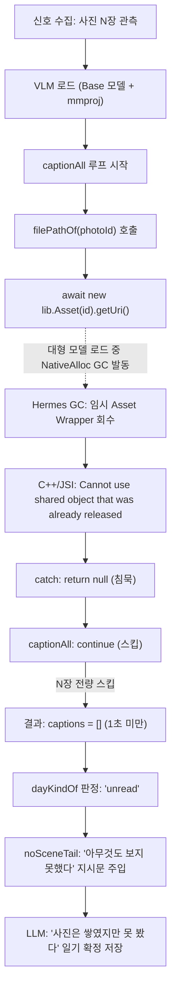

# 사진 있는 날의 VLM 캡션 전량 스킵 및 사진 없는 일기 생성 결함 — 원인 분석과 개선 과제

2026-10-10. 테스트 디바이스(SM-G986N, Android 13)에서 사진이 존재하는 날임에도 「사진 속을 보지 못했다」는 일기가 저장되고 사진 캐러셀이 사라지는 현상에 대한 원인 분석과 개선 과제다.

---

## 1. 관측된 현상 (증상)

* **저장된 일기 내용**:
  * `2026-10-08`: 사진 6장이 찍힌 날인데, 본문이 `"나는 오늘 아무것도 보지 못했다. 사진은 쌓였지만, 그 속을 끝까지 들여다보지 못해 심심했다. 내일은 무엇이든 보여 줬으면 좋겠다."`로 저장됨.
  * `2026-10-05`: 사진 12장이 찍힌 날인데, 본문이 `"나는 오늘 아무것도 보지 못했다. 사진은 쌓였지만, 그 속을 끝까지 들여다보지 못한 나는 심심했고 하품만 했다. 내일은 무엇이든 보여 줬으면 좋겠다."`로 저장됨.
  * 두 날짜 모두 홈 화면 상세에서 사진 캐러셀이 표시되지 않음.
* **일기 파일(`files/diary/*.json`)의 메트릭 실측값**:
  * `signalsUsed.photos`: `known`, 각각 6장과 12장의 사진 정보가 정상 수집되어 있음.
  * 최상위 `photos` 배열(`usedPhotos`): 존재하지 않음(`undefined`).
  * `timing.visionMs`:
    * `2026-10-08`: **972ms**
    * `2026-10-05`: **1027ms**
* **정상 동작과의 비교**:
  * 동일 기기에서 화면의 「다시 쓰기」를 눌러 포그라운드에서 재실행했을 때:
    * `2026-10-08`: `visionMs: 23963ms` (장당 약 4초), 6장 캡션 완료, 총기·액자 사진 본문 묘사, 6장 캐러셀 복구.
    * `2026-10-05`: `visionMs: 38211ms` (장당 약 4.7초), 8장 캡션 완료, 호텔·노트('AMIGOS')·조식·야경 다리 본문 묘사, 8장 캐러셀 복구.
  * 즉, 1초 안팎에 종료된 것은 **VLM 캡션 추론이 정상 수행된 것이 아니라 사진 전량이 즉시 스킵된 것**이다.

---

## 2. 근본 원인 분석



### ① Expo `SharedObject`와 Hermes GC 간의 비동기 레이스 컨디션
* [`src/signals/expo-port.ts`](file:///c:/Users/mrtin/projects/alpharium/src/signals/expo-port.ts#L223-L234)의 `filePathOf`:
  ```typescript
  const lib = await import("expo-media-library");
  const uri = await new lib.Asset(photoId).getUri();
  ```
* `expo-media-library`의 `Asset` 클래스는 Kotlin의 `expo.modules.kotlin.sharedobjects.SharedObject`를 상속받은 네이티브 공유 객체다.
* `getUri()`는 내부에서 MediaStore ContentResolver 쿼리를 `withContext(Dispatchers.IO)`로 비동기 전환하여 처리한다.
* JS 코드에서는 `new lib.Asset(photoId)`를 로컬 변수에 할당하지 않고 임시 평가 식으로 생성한 뒤 `await`를 건다.
* 이 시점에 백그라운드 환경이나 모델 적재(VLM ~500MB, kanana ~1.2GB)로 인해 네이티브 힙 메모리 압박이 발생하면, 안드로이드가 `Waiting for a blocking GC NativeAlloc`을 트리거하여 Hermes GC가 실행된다.
* JS 스택에 참조가 없는 임시 `Asset` 인스턴스는 GC에 의해 수거되고, C++/JSI 브릿지는 `Cannot use shared object that was already released` 예외를 던진다. *(2026-10-09 `expo-file-system`의 `File` 객체에서 관측되어 `*Sync()`로 교체했던 결함과 동일한 계열)*

### ② 조용한 실패(Silent Fallback) 방어 구조로 인한 버그 은폐
* `filePathOf`의 `catch` 블록은 예외를 로깅하지 않고 `null`을 반환한다.
* [`src/vision/caption.ts`](file:///c:/Users/mrtin/projects/alpharium/src/vision/caption.ts#L95-L103)의 `captionAll`은 원칙 E4("한 장의 실패가 전체를 무너뜨리지 않는다")에 따라 `path === null`이면 조용히 `continue`한다.
* N장의 사진이 수 밀리초 만에 모두 스킵되더라도 오류나 예외 없이 `{ captions: [], available: N, considered: N }`으로 성공 반환된다.

### ③ 프롬프트 엔진의 `unread` 갈래 격하
* [`src/diary/prompt.ts`](file:///c:/Users/mrtin/projects/alpharium/src/diary/prompt.ts#L680-L686)의 `dayKindOf`는 사진이 존재하지만 캡션이 0개인 경우를 `"unread"`(사진은 있는데 속을 들여다보지 못한 날)로 분류한다.
* [`noSceneTail('unread')`](file:///c:/Users/mrtin/projects/alpharium/src/diary/prompt.ts#L844-L853)은 LLM에게 다음과 같이 프롬프트를 준다:
  > `'나는 오늘 아무것도 보지 못했다'는 말로 시작하고, 사진은 쌓였는데 그 속을 끝까지 들여다보지 못한 내가 어땠는지 적는다.`
* LLM은 이 지시를 충실히 수행하여 `"나는 오늘 아무것도 보지 못했다..."` 일기를 작성하고, 시스템은 이를 오류 없는 정상 일기로 데이터베이스에 영구 저장한다.
* 또한 캡션된 사진이 0장이므로 일기의 `photos` 배열(`usedPhotos`)이 빠져 홈 화면에 사진 캐러셀이 나오지 않는다.

---

## 3. 릴리즈 환경에서의 위험도 평가

| 실행 환경 | 발생 위험도 | 분석 |
| :--- | :---: | :--- |
| **포그라운드 수동 생성 / 다시 쓰기** | **낮음~보통** | 앱이 포그라운드에 단독 실행 중이므로 시스템 메모리가 안정적이고 GC 간섭이 적음. |
| **백그라운드 자동 일기 생성 (주 경로)** | **높음** | Doze 모드, WorkManager/JobScheduler 실행, 타 앱(카메라·SNS 등) 사용 직후 등 시스템 가용 RAM이 타이트하여 `TRIM_MEMORY_RUNNING_CRITICAL` 및 `NativeAlloc` GC가 빈번히 발동. |
| **RAM 6GB~8GB 기기** | **매우 높음** | 온디바이스 모델 2개가 교대로 메모리에 적재될 때 시스템 GC 임계치를 쉽게 넘음. |

* **사용자 경험 영향**: 크래시 없이 조용히 일기가 저장되므로 겉으로는 버그가 없는 것처럼 보이지만, 사진을 찍은 사용자는 **"사진이 있는데 왜 매번 사진을 못 봤다고 일기를 쓰지?"**라는 실망을 겪게 되며, 앱의 핵심 가치(내 폰이 나를 본다)가 훼손된다.

---

## 4. 해결 방안 (Action Items)

### 1) `Asset` 객체의 JS GC 조기 회수 방지 (수명 보장)
* `new lib.Asset(photoId).getUri()` 패턴을 지양하고, 로컬 변수에 할당한 뒤 `await` 완료 시점까지 참조를 유지한다.
* 적용 대상 ([`src/signals/expo-port.ts`](file:///c:/Users/mrtin/projects/alpharium/src/signals/expo-port.ts)):
  * `filePathOf(photoId)`: `Asset.getUri()` 호출부
  * `folderNamesFor(photoIds)`: 병렬 `Asset.getUri()` 호출부
  * `locationOf(photoId)`: `Asset.getLocation()` 호출부
* 예시:
  ```typescript
  const asset = new lib.Asset(photoId);
  try {
    const uri = await asset.getUri();
    if (asset.id === "") return null; // await 이후 참조 유지
    ...
  }
  ```

### 2) VLM 전량 실패 가드 (Silent Fallback 가드)
* 관측된 사진이 N장(예: 1장 이상) 존재하는데 캡션된 결과가 0장인 경우:
  * 이것이 하드웨어 I/O나 SharedObject의 일시적 오류일 가능성을 고려하여, 침묵하고 `unread` 거짓 일기를 확정 저장하기 전에 1회 짧은 재시도를 수행하거나,
  * 진단 로그에 캡션 스킵 사유를 남겨 문제 기기를 식별할 수 있도록 방어벽을 강화한다.

### 3) 소스 계약 테스트 작성
* `expo-file-system`의 `__tests__/diary/expo-file-sync.test.ts`와 유사하게, `expo-media-library`의 `new lib.Asset()`이 임시 객체로 즉시 await되지 않는지 소스 코드를 정적으로 잠그는 계약 테스트를 추가한다.
