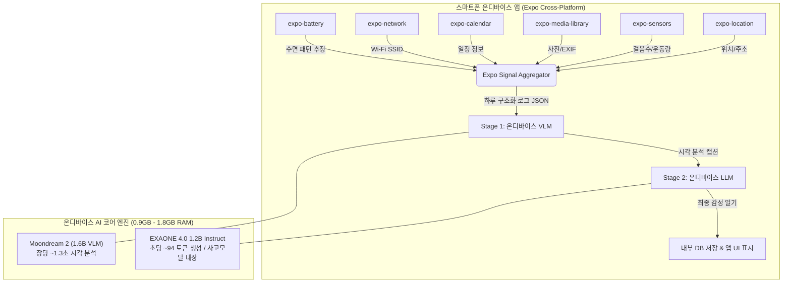

# 📱 온디바이스 AI 일기 작성 시스템 종합 개발 마스터 플랜

> **프로젝트 목표:**  
> 사용자 개인 디바이스에 저장되는 일상 로그(사진, GPS 위치, 걸음 수, 캘린더 일정, Wi-Fi 신호)를 **외부 서버 전송 없이 100% 온디바이스 AI(On-Device AI)**로 처리하여, 하루를 기록하는 감성적인 1인칭 한국어 일기를 자동으로 작성하는 앱 구축

---

## 🏗️ 1. 전체 시스템 아키텍처 (2-Stage Pipeline)



---

## 📊 2. 검증된 실측 성능 수치 (PoC Benchmark)

| 구 분 | 📱 **방안 B: 순수 모바일 온디바이스 (최종 탑재본)** | 💻 **방안 A: 맥북 호스트 서버 (개발/테스트용)** |
| :--- | :---: | :---: |
| **사용 AI 모델 조합** | **`Moondream 1.6B` + `EXAONE 4.0 1.2B`** | `Qwen 3 VL 8B` + `EXAONE 3.5 7.8B` |
| **스마트폰 RAM 점유량** | **약 1.8 GB 미만** (모바일 상주 가능) | 약 10.9 GB VRAM (맥북 자원 사용) |
| **사진 1장 시각 분석 속도** | **약 1.3 초 / 장** | 약 17.5초 ~ 32.6초 / 장 |
| **LLM 일기 작성 속도** | **`94.31 tokens/sec` (초당 94글자)** | `22.81 tokens/sec` (초당 22글자) |
| **전체 파이프라인 총소요시간**| **약 11.1 초 (사진 3장 기준)** | 약 91.6 초 (사진 3장 기준) |
| **오프라인 동작 여부** | **100% 오프라인 동작 가능** | 인터넷/터널 필요 |

---

## 📱 3. Expo 기반 수집 개인 신호 & 데이터 파이프라인

Expo(React Native) 표준 SDK 모듈을 사용하여 수집한 정규화 데이터는 다음과 같은 JSON 규격으로 정제되어 AI에게 전달됩니다.

### 🧩 온디바이스 프롬프트 전달 JSON 규격 예시
```json
{
  "date": "2026-07-31",
  "daily_stats": {
    "total_steps": 10200,
    "sleep_duration": "7시간 20분",
    "wifi_locations": ["Home_5G (아침)", "Office_Wi-Fi (낮)", "Starbucks_Free (저녁)"]
  },
  "timeline_logs": [
    {
      "time": "08:45 AM",
      "location": "성수동 카페거리 (Starbucks_Free)",
      "photo_vision_caption": "나무 테이블 위의 하트 모양 라떼아트 커피잔과 녹색 식물들"
    },
    {
      "time": "12:30 PM",
      "location": "강남역 (캘린더: 팀원 점심 회식)",
      "photo_vision_caption": "어두운 원목 가구와 대형 창문이 어우러진 모던한 식당 내부"
    },
    {
      "time": "07:50 PM",
      "location": "한강시민공원 (활동: 런닝 5km)",
      "photo_vision_caption": "청록색 호수 위를 지나는 나무 보트와 울창한 소나무 숲 풍경"
    }
  ]
}
```

---

## 🛠️ 4. 맥북 호스트 개발 & 테스트 서버 환경 (현재 구축 완료)

앱 개발 과정에서 테스트 API 서버로 작동하도록 구축된 맥북 호스트 환경 상태입니다.

1. **하드웨어 최적화 세팅 (MacBook Pro M1 Pro 16GB)**
   * `OLLAMA_FLASH_ATTENTION = 1` (Metal Flash Attention 가속)
   * `OLLAMA_KV_CACHE_TYPE = q8_0` (VRAM 50% 절감)
   * `OLLAMA_KEEP_ALIVE = -1` (VRAM 영구 상주 / Cold-start 0초)
   * `OLLAMA_NUM_PARALLEL = 1` (단일 사용자 0.5초 반응속도 튜닝)

2. **외부 HTTPS 서빙 (Tailscale Funnel & 재부팅 자동 유지)**
   * **Base URL:** `https://macbook.yattle-mora.ts.net/v1`
   * **자동 기동:** Mac 재부팅 시 Ollama 및 Tailscale Funnel 자동 백그라운드 재개 (`launchd` 등록 완료)

---

## 🚀 5. 단계별 개발 로드맵 (Roadmap)

1. **Step 1: Expo 프론트엔드 모바일 앱 뼈대 구축**
   * Expo React Native 프로젝트 생성 (`npx create-expo-app`)
   * `expo-location`, `expo-sensors`, `expo-media-library`, `expo-calendar` 권한 및 수집 로직 구현

2. **Step 2: 맥북 호스트 API 서버 기반 시뮬레이션**
   * 앱에서 수집한 신호를 맥북 API 서버(`https://macbook.yattle-mora.ts.net/v1`)로 보내 일기 생성 UI/UX 및 프롬프트 검증

3. **Step 3: 순수 모바일 온디바이스 이식 (Pure Mobile)**
   * iOS: `CoreML` / `ExecuTorch`에 **`EXAONE 4.0 1.2B`** 모델 이식
   * Android: `MediaPipe LLM Inference`에 모델 이식
   * 100% 오프라인 온디바이스 앱 배포!
